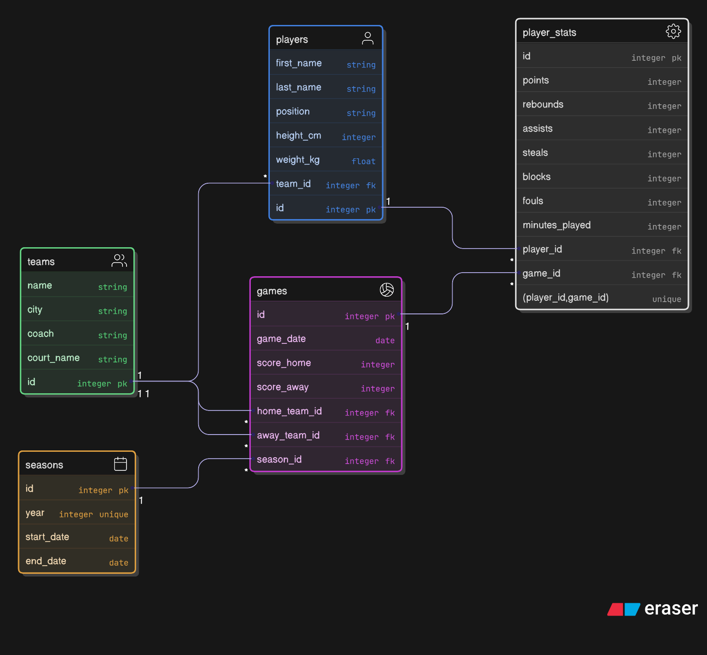

# Design Document

By Samin Sharif

Video overview: https://youtu.be/HXnTMIkd5kE

## Scope

### Purpose

I am a big fan of the NBA and basketball, so I wanted to create a SQL database to store information about a regular NBA season. This database is designed to track basketball teams, players, games, and player performance statistics over multiple seasons. It allows users to store, organize, and query data such as player stats per game, team performance, and season records.

### Inside the Scope

- **Players:** Personal details such as first name, last name, position, height, weight, and team association.
- **Teams:** Name, city, coach, and home court.
- **Seasons:** Start and end dates, year of the season.
- **Games:** Home and away teams, game date, scores, and season association.
- **Player statistics:** Points, rebounds, assists, steals, blocks, fouls, and minutes played for each game.

### Outside the Scope

- **Historical injury data or salaries.**
- **Personal life information about players.**
- **Real time updates for games.**

## Functional Requirements

### User Capabilities

- Add, update, or delete teams, players, seasons, and games.
- Record player statistics for individual games.
- Query total stats for a player across games or within a season.
- Query team scores and game results.
- Identify top scorers, rebounders, or other performance leaders.
- Retrieve game schedules for a specific team or season.

### Beyond the Scope

- Real time tracking of games or live updates.
- Visualization dashboards or graphical reports.

## Representation

### Entities

#### ER Diagram

The entities in this database represent the core components of a basketball tracking system. Each entity captures a different aspect of the league: players, teams, seasons, games, and player statistics.

**Players**  
The Players entity table stores attributes such as `first_name`, `last_name`, `position`, `height_cm`, and `weight_kg`, along with a `team_id` which is a foreign key to link each player to their team. The chosen data types are `VARCHAR` for names, `ENUM` for positions to ensure only valid roles can be entered, `INT` for height, and `DECIMAL` for weight to allow fractional precision. Constraints such as `NOT NULL` are put to ensure that essential player details are always present.

**Teams**  
The Teams entity includes attributes like `name`, `city`, `coach`, and `court_name`. These are stored as `VARCHAR` fields to support text data of variable length.

**Seasons**  
The Seasons entity tracks the `year`, `start_date`, and `end_date` of each season. The `year` is marked as `UNIQUE` to prevent duplicate seasons. Additionally, the date columns are given the `DATE` type so we can ensure accurate queries based on the time or date.

**Games**  
The Games entity includes `game_date`, `home_team_id`, `away_team_id`, `score_home`, `score_away`, and `season_id`. This entity is a bit complicated because we take in two ids as references to two different teams. We also use `DATE` to ensure proper handling of the game schedule, while integer fields track team scores. Foreign keys to `teams` and `seasons` maintain referential integrity so every game links back to valid teams and a valid season.

**Player_Stats**  
The Player_Stats entity captures a player’s performance in a single game. It contains attributes such as `points`, `rebounds`, `assists`, `steals`, `blocks`, `fouls`, and `minutes_played`. These are stored as `INT`. We have `DECIMAL` for minutes played for more precise tracking. The most important part is the `UNIQUE(player_id, game_id)` constraint which ensures that each player has at most one stats entry per game, preventing duplication.

### Relationships

The database is designed with clear relationships between its entities to accurately represent basketball data. Each team can have many players, establishing a one to many relationship between the `teams` and `players` tables. Similarly, each season can include many games, creating a one to many relationship between `seasons` and `games`. The `games` table connects to `teams` twice, once for the home team and once for the away team, reflecting which teams participated in each game. Players participate in many games, and each game includes many players, which forms a many to many relationship between `players` and `games`. This relationship is implemented through the `player_stats` table, which serves as a bridge table storing performance data for each player in each game.

## Optimizations

To improve the performance of the database, several optimizations were implemented. Indexes were created on the `player_stats` table to speed up common queries. An index on `player_id` allows for fast retrieval of all statistics for a specific player, while an index on `game_id` allows quick access to all player statistics for a particular game. I only have three indexes because I only wanted to add indexes for the tables that are used the most and also not use too much space in the database. I only have one view that I commonly used. The `player_totals_by_season` view is an optimization that simplifies and speeds up queries for player performance over a season. Rather than writing a complex query each time to calculate total points, rebounds, assists, steals, blocks, and minutes played, this view calculates the data by player and season.

## Limitations

The database does not support real-time game tracking or live updates. It does not store detailed historical player injuries, contracts, salaries, or off court events. Team and player transfers mid season are not tracked in detail, as the database assumes static team membership per record. Advanced basketball analytics, such as player efficiency ratings, plus-minus, or advanced shooting metrics, are not included. Changes in team names, arenas, or coaching staff over time may be difficult to represent without additional tables or historical tracking. Overall, the database is primarily focused on standard box score statistics and may not capture every aspect of a game or player performance.
